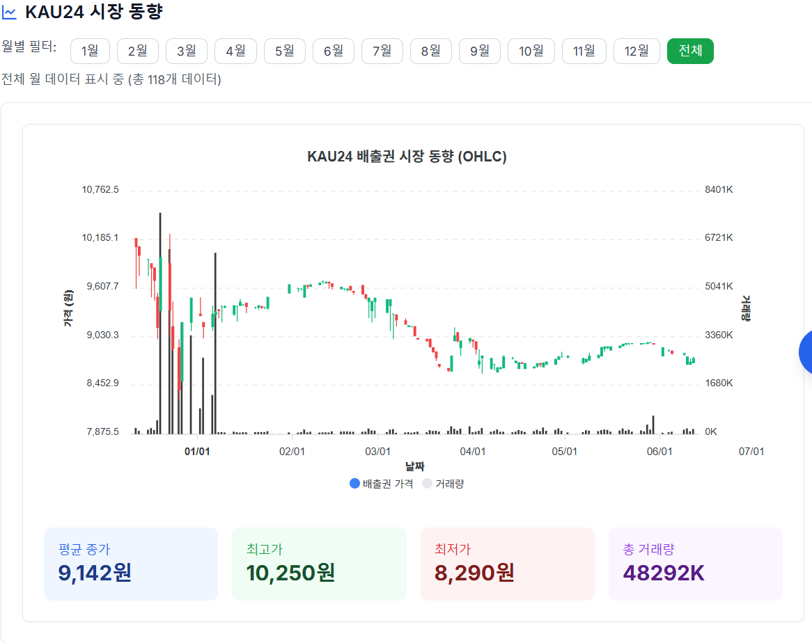
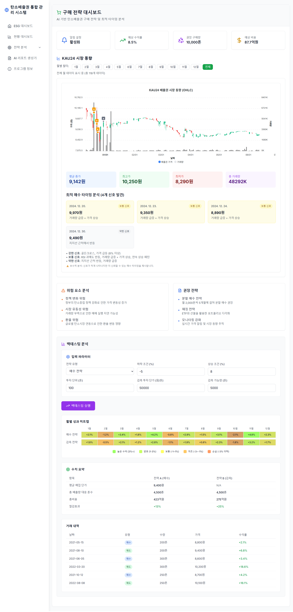
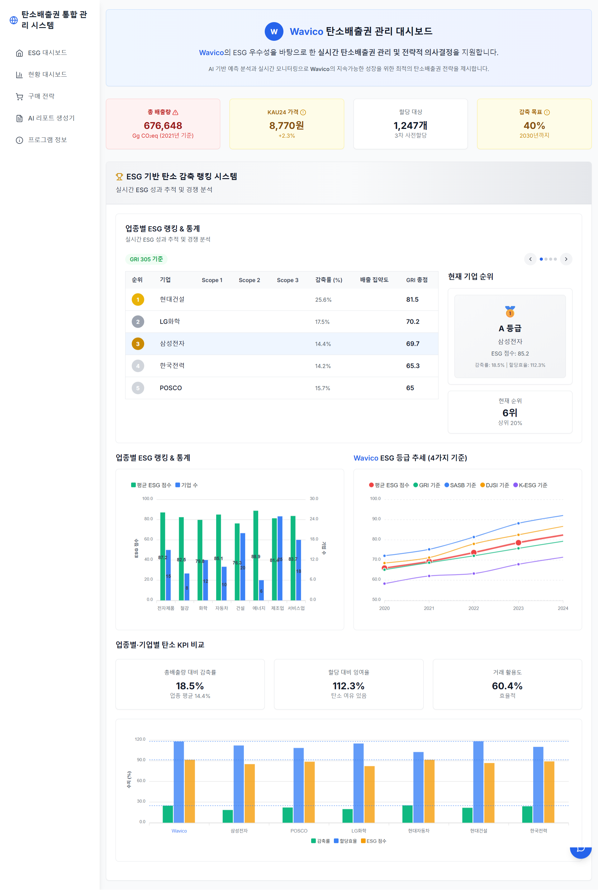

# 🌍 탄소배출권 대시보드 페이지별 UX/데이터 분석

## 📊 Dashboard.tsx - 메인 대시보드

### 📸 **대시보드 스크린샷**


_메인 대시보드 전체 화면 - 실시간 현황, 온실가스 배출량, KAU24 시장 동향, 지역별 CO2 농도_


_실시간 현황 게이지 차트와 필터링 시스템_

.png>)
_온실가스 배출량 현황 차트_

.png>)
_KAU24 시장 동향 차트와 월별 필터_

.png>)
_지역별 이산화탄소 농도 현황 지도_

.png>)
_지역별 상세 정보 패널_

.png>)
_필터링 시스템과 데이터 개수 표시_

### **🎯 UX 설계 목표**

- **원스톱 정보 제공**: 탄소배출량 현황과 시장 동향을 한 페이지에서 확인
- **인터랙티브 필터링**: 연도/월별 데이터 필터링으로 세밀한 분석
- **시각적 계층구조**: 중요도에 따른 정보 배치와 색상 코딩

### **📊 사용된 데이터**

#### **실제 데이터**

```typescript
// 환경부 공식 데이터
emissionsData: EmissionData[] // 국가 온실가스 인벤토리 (1990-2021)

// KAU24 시장 데이터
marketData: MarketData[] // 실제 거래 데이터
{
  일자: Date
  시가: number
  고가: number
  저가: number
  종가: number
  거래량: number
  월: number
}
```

#### **시뮬레이션 데이터**

```typescript
// 업체별 할당량 (10개 주요 기업)
const companies = [
  { name: "포스코", sector: "철강" },
  { name: "현대자동차", sector: "자동차" },
  // ...
];

// 지역별 CO2 농도 (15개 주요 도시)
const regions = [
  { name: "서울", lat: 37.5665, lng: 126.978, baseCO2: 420 },
  { name: "부산", lat: 35.1796, lng: 129.0756, baseCO2: 415 },
  // ...
];
```

### **🎨 UX 특징**

#### **1. 헤더 섹션**

- **명확한 제목**: "현황 대시보드"
- **설명 텍스트**: 페이지 목적 명시
- **아이콘**: LineChart로 데이터 중심 페이지 표현

#### **2. 필터링 시스템**

```typescript
// 연도 슬라이더 (2020-2030)
<input type="range" min="2020" max="2030" value={selectedYear} />

// 월 슬라이더 (전체/1-12월)
<input type="range" min="0" max="12" value={selectedMonth} />
```

- **실시간 색상 변화**: 선택된 값에 따른 그라데이션
- **시각적 피드백**: 선택된 값이 배지 형태로 표시

#### **3. 주요 섹션별 UX**

##### **📊 실시간 현황 (GaugeCharts)**

- **목적**: 핵심 지표를 한눈에 파악
- **색상 코딩**: 상태별 색상 구분 (양호/주의/위험)
- **애니메이션**: 부드러운 게이지 애니메이션

##### **🌍 온실가스 배출량 현황**

- **데이터 소스**: 환경부 공식 데이터
- **신뢰성**: 정부 데이터 기반
- **시각화**: EmissionChart 컴포넌트

##### **📈 KAU24 시장 동향**

```typescript
// 월별 필터링
const filteredData = marketData.filter(
  (d) => selectedMonth === 0 || d.월 === selectedMonth
);
```

- **필터링**: 월별 버튼 필터 (1-12월 + 전체)
- **실시간 정보**: 선택된 필터에 따른 데이터 개수 표시
- **차트**: MarketChart로 시장 동향 시각화

##### **🗺️ 지역별 이산화탄소 농도 현황**

```typescript
// 농도별 색상 코딩
let markerColor = "#10B981"; // 녹색 (낮음)
if (region.평균_이산화탄소_농도 > 420) {
  markerColor = "#EF4444"; // 빨간색 (높음)
} else if (region.평균_이산화탄소_농도 > 410) {
  markerColor = "#F59E0B"; // 주황색 (중간)
}
```

- **인터랙티브 지도**: Leaflet 기반 지도
- **마커 시스템**: 농도별 색상 코딩
- **상세 패널**: 지역 선택 시 우측에 상세 정보
- **상태 표시**: 양호/주의/높음 상태 구분
- **추천 조치**: 농도별 맞춤 조치 제안

### **🔄 데이터 처리 로직**

#### **동적 데이터 생성**

```typescript
// 연도별 추세
const yearlyIncrease = (year - 2020) * 2;

// 계절적 변동성
const seasonalFactor = 1 + 0.1 * Math.sin(((month - 1) * Math.PI) / 6);

// 도시별 특성
const cityFactor = region.name === "서울" ? 1.1 : 1.0;
```

#### **실시간 필터링**

- **월별 필터**: 선택된 월에 따른 데이터 필터링
- **연도별 업데이트**: 선택된 연도에 따른 모든 차트 동기화

---

## 💹 Strategy.tsx - 구매 전략 대시보드

### 📸 **구매 전략 스크린샷**


_구매 전략 대시보드 전체 화면 - Quick Stats, 시장 동향, 백테스팅 시스템_


_Quick Stats 카드와 시장 동향 차트_

.png>)
_백테스팅 파라미터 설정과 전략 시뮬레이션_

.png>)
_백테스팅 결과 히트맵과 수익률 비교_

.png>)
_월별 성과 히트맵과 수치 요약_

### **🎯 UX 설계 목표**

- **AI 기반 전략**: 데이터 기반 구매 전략 제시
- **실시간 분석**: 시장 동향과 타이밍 분석
- **백테스팅 통합**: 전략 시뮬레이션 기능

### **📊 사용된 데이터**

#### **실제 데이터**

```typescript
// KAU24 시장 데이터
marketData: MarketData[] // 실제 거래 데이터
```

#### **시뮬레이션 데이터**

```typescript
// 가격 데이터 생성 (365일)
const generatePriceData = () => {
  const basePrice = 8770;
  const seasonal = Math.sin((i / 365) * 2 * Math.PI) * 500;
  const trend = (i / 365) * 1000;
  const volatility = (Math.random() - 0.5) * 400;

  return {
    dates: string[],
    prices: number[],
    volumes: number[],
    recommendations: ("매수" | "관망")[]
  };
};
```

### **🎨 UX 특징**

#### **1. 헤더 섹션**

- **제목**: "구매 전략 대시보드"
- **설명**: "AI 기반 탄소배출권 구매 전략 및 최적 타이밍 분석"
- **아이콘**: ShoppingCart로 구매 중심 페이지 표현

#### **2. Quick Stats (4개 카드)**

```typescript
// 알림 설정
<div>활성화</div>

// 예상 수익률
<div>8.5%</div>

// 권장 구매량
<div>10,000톤</div>

// 예상 비용
<div>87.7억원</div>
```

- **핵심 지표**: 구매 전략에 필요한 핵심 정보
- **색상 구분**: 각 카드별 의미있는 아이콘과 색상

#### **3. 시장 동향 차트**

- **월별 필터링**: 1-12월 + 전체 선택 가능
- **실시간 데이터**: 선택된 필터에 따른 데이터 개수 표시
- **MarketChart**: 시장 동향 시각화

#### **4. 백테스팅 시스템**

```typescript
// Backtesting 컴포넌트 통합
<Backtesting
  companySize={companySize}
  annualEmission={annualEmission}
  currentAllocation={currentAllocation}
  budget={budget}
  riskTolerance={riskTolerance}
  analysisPeriod={analysisPeriod}
  marketData={marketData}
  loading={loading}
/>
```

- **전략 시뮬레이션**: 매수/감축 전략 성과 분석
- **파라미터 설정**: 전략 유형, 매수/매도 조건 등
- **히트맵 시각화**: 월별 성과 비교

### **🔄 데이터 처리 로직**

#### **가격 데이터 생성**

```typescript
// 계절적 변동성
const seasonal = Math.sin((i / 365) * 2 * Math.PI) * 500;

// 장기 트렌드
const trend = (i / 365) * 1000;

// 변동성
const volatility = (Math.random() - 0.5) * 400;

// 매수 권장 로직
recommendations.push(price < basePrice + seasonal ? "매수" : "관망");
```

---

## 🤖 Chatbot.tsx - AI 챗봇

### 📸 **AI 챗봇 스크린샷**


_AI 챗봇 전체 화면 - 예시 질문과 대화 인터페이스_


_예시 질문과 입력창_

.png>)
_사용자 질문과 AI 응답_

.png>)
_데이터 분석 결과와 마크다운 응답_

.png>)
_부문별 비교 분석 결과_

.png>)
_연도별 변화 추이 분석_

.png>)
_상세한 데이터 분석과 수치 정보_

### **🎯 UX 설계 목표**

- **자연스러운 대화**: 사용자 친화적인 인터페이스
- **스마트 분석**: 복잡한 데이터 질문도 즉시 분석
- **예시 제공**: 사용자가 쉽게 질문할 수 있는 가이드

### **📊 사용된 데이터**

#### **실제 데이터**

```typescript
// 국가 온실가스 인벤토리 (1990-2021)
const emissionsData = {
  2017: 679600, // Gg CO₂eq
  2021: 656287, // Gg CO₂eq
  // ...
};

// 부문별 배출량
const sectorData = {
  에너지: 459801, // 70.1%
  수송: 98852, // 15.1%
  산업공정: 56124, // 8.5%
  농업: 20845, // 3.2%
  폐기물: 16517, // 2.5%
};
```

### **🎨 UX 특징**

#### **1. 헤더 섹션**

- **제목**: "AI 챗봇 상담"
- **설명**: "탄소배출권 관련 질문을 해주세요"
- **아이콘**: MessageCircle로 대화형 인터페이스 표현

#### **2. 예시 질문**

```typescript
const exampleQueries = [
  "📈 총배출량의 연도별 변화 추이는?",
  "🏭 에너지 산업과 수송 산업의 배출량 비교",
  "📊 2017년과 2021년의 배출량 차이는?",
  "🔍 가장 많이 배출하는 분야는?",
  "📉 감축률이 가장 높은 연도는?",
  "🌍 전체 데이터에서 평균 배출량은?",
];
```

- **클릭 가능**: 예시 질문 클릭 시 자동 입력
- **이모지**: 시각적 구분과 친근감 제공

#### **3. 대화 인터페이스**

```typescript
// 메시지 타입별 스타일링
const messageStyle =
  message.role === "user"
    ? "bg-blue-600 text-white ml-8"
    : "bg-gray-100 text-gray-900 mr-8";
```

- **사용자 메시지**: 우측 정렬, 파란색 배경
- **AI 응답**: 좌측 정렬, 회색 배경
- **타임스탬프**: 각 메시지별 시간 표시

#### **4. 스마트 분석 로직**

```typescript
const analyzeQuery = (query: string): string => {
  const lowerQuery = query.toLowerCase();

  if (lowerQuery.includes("추이") || lowerQuery.includes("변화")) {
    return `📈 **연도별 배출량 변화 추이 분석**...`;
  }
  // ... 다양한 분석 로직
};
```

### **🔄 데이터 처리 로직**

#### **키워드 기반 분석**

```typescript
// 추이/변화 관련 질문
if (lowerQuery.includes("추이") || lowerQuery.includes("변화")) {
  // 연도별 변화 추이 분석
}

// 비교 관련 질문
if (lowerQuery.includes("비교") || lowerQuery.includes("에너지")) {
  // 부문별 비교 분석
}

// 특정 연도 관련 질문
if (lowerQuery.includes("2017") || lowerQuery.includes("2021")) {
  // 연도별 상세 비교
}
```

#### **마크다운 응답**

- **구조화된 정보**: 제목, 목록, 강조 표시
- **이모지 활용**: 시각적 구분과 친근감
- **수치 중심**: 정확한 데이터 제공

---

## 📄 ReportGenerator.tsx - AI 리포트 생성기

### 📸 **AI 리포트 생성기 스크린샷**


_AI 리포트 생성기 전체 화면 - 드래그 앤 드롭 목차 편집과 PDF 업로드_


_목차 편집 인터페이스_

.png>)
_드래그 앤 드롭 기능과 목차 구조_

.png>)
_목차 편집과 추가/삭제 기능_

.png>)
_AI 기반 보고서 생성 결과_

### **🎯 UX 설계 목표**

- **드래그 앤 드롭**: 직관적인 목차 편집
- **실시간 생성**: AI 기반 보고서 자동 생성
- **문서 업로드**: PDF 참고 문서 분석

### **📊 사용된 데이터**

#### **AI API 연동**

```typescript
// OpenAI API 호출
const response = await fetch("/api/generate-outline", {
  method: "POST",
  headers: { "Content-Type": "application/json" },
  body: JSON.stringify({
    topic: topic,
    templateText: templateText,
  }),
});
```

#### **목차 데이터 구조**

```typescript
type OutlineNode = {
  id: string;
  title: string;
  children?: OutlineNode[] | null;
};
```

### **🎨 UX 특징**

#### **1. 헤더 섹션**

- **제목**: "AI 리포트 생성기"
- **설명**: "PDF 문서를 참고하여 새로운 주제의 보고서를 생성합니다"
- **아이콘**: FileText로 문서 생성 기능 표현

#### **2. 드래그 앤 드롭 인터페이스**

```typescript
// DndContext 설정
<DndContext
  sensors={sensors}
  collisionDetection={closestCenter}
  onDragEnd={handleDragEnd}
>
  <SortableContext
    items={nodes.map((n) => n.id)}
    strategy={verticalListSortingStrategy}
  >
    {renderOutline(nodes)}
  </SortableContext>
</DndContext>
```

- **드래그 핸들**: 시각적 드래그 영역
- **드래그 중 스타일**: 투명도와 그림자 효과
- **드롭 영역**: 명확한 드롭 위치 표시

#### **3. 목차 편집 기능**

```typescript
// 편집 기능
<input
  value={node.title}
  onChange={(e) => onEdit(node.id, e.target.value)}
  style={{
    fontSize: 16,
    fontWeight: 500,
    flex: 1,
    background: "transparent",
    border: "none",
    outline: "none"
  }}
/>

// 추가/삭제 버튼
<button onClick={() => onAdd(node.id)}>추가</button>
<button onClick={() => onDelete(node.id)}>삭제</button>
```

- **실시간 편집**: 인라인 텍스트 편집
- **계층 구조**: 하위 항목 추가/삭제
- **시각적 피드백**: 호버 효과와 애니메이션

#### **4. 문서 업로드**

```typescript
// 파일 업로드 처리
const handleFileUpload = (event: React.ChangeEvent<HTMLInputElement>) => {
  const file = event.target.files?.[0];
  if (file && file.type === "application/pdf") {
    // PDF 파일 처리
  }
};
```

- **PDF 전용**: PDF 파일만 업로드 가능
- **파일 크기 제한**: 적절한 파일 크기 제한
- **업로드 상태**: 로딩 상태 표시

### **🔄 데이터 처리 로직**

#### **목차 구조 관리**

```typescript
// 재귀적 ID 부여
function assignIds(nodes: any[]): OutlineNode[] {
  return nodes.map((n) => ({
    id: n.id || generateId(),
    title: n.title,
    children: n.children ? assignIds(n.children) : null,
  }));
}

// 드래그 앤 드롭 처리
const handleDragEnd = (event: DragEndEvent) => {
  const { active, over } = event;
  if (active.id !== over?.id) {
    setNodes((items) => {
      const oldIndex = items.findIndex((item) => item.id === active.id);
      const newIndex = items.findIndex((item) => item.id === over?.id);
      return arrayMove(items, oldIndex, newIndex);
    });
  }
};
```

#### **AI API 연동**

```typescript
// 목차 생성
const response = await fetch("/api/generate-outline", {
  method: "POST",
  headers: { "Content-Type": "application/json" },
  body: JSON.stringify({ topic, templateText }),
});

// 보고서 생성
const reportResponse = await fetch("/api/generate-report", {
  method: "POST",
  headers: { "Content-Type": "application/json" },
  body: JSON.stringify({ topic, outline: convertOutlineKeys(outline) }),
});
```

## 🔍 StrategyAnalysis.tsx - 감축 전략 분석

### 📸 **감축 전략 분석 스크린샷**


_감축 전략 분석 전체 화면 - 전략 비교와 성과 분석_


_전략 분석 메인 화면_

.png>)
_전략 비교 차트와 분석 결과_

.png>)
_상세한 전략 분석과 성과 지표_

.png>)
_전략별 성과 비교와 최적화 제안_

---

## 📊 전체 시스템 데이터 플로우

### **데이터 소스**

1. **환경부 공식 데이터**: 국가 온실가스 인벤토리
2. **KAU24 시장 데이터**: 실제 거래 데이터
3. **시뮬레이션 데이터**: 업체별 할당량, 지역별 CO2 농도
4. **AI API**: OpenAI 기반 분석 및 생성

### **데이터 처리 파이프라인**

```typescript
// 1. 데이터 로딩
const { emissionsData, marketData, loading } = useData();

// 2. 필터링
const filteredData = data.filter(d =>
  selectedMonth === 0 || d.월 === selectedMonth
);

// 3. 시각화
<Chart data={filteredData} />

// 4. 인터랙션
onClick={() => setSelectedData(data)}
```

### **성능 최적화**

- **지연 로딩**: 필요할 때만 데이터 로드
- **메모이제이션**: 계산 결과 캐싱
- **가상화**: 대용량 데이터 렌더링 최적화
- **코드 스플리팅**: 라우트별 코드 분할

---

## 🎯 UX 설계 원칙

### **1. 사용자 중심 설계**

- **직관적 네비게이션**: 명확한 메뉴 구조
- **일관된 디자인**: 색상, 아이콘, 레이아웃 통일성
- **접근성**: 키보드 네비게이션 및 스크린 리더 지원

### **2. 데이터 시각화**

- **적절한 차트 선택**: 데이터 특성에 맞는 시각화
- **색상 코딩**: 의미있는 색상 사용
- **인터랙티브 요소**: 호버, 클릭, 드래그 기능

### **3. 성능 최적화**

- **빠른 로딩**: Vite 기반 빠른 개발 및 빌드
- **반응형 디자인**: 모바일과 데스크톱 최적화
- **오프라인 지원**: PWA 기능으로 오프라인 사용 가능

### **4. 확장성**

- **모듈화**: 재사용 가능한 컴포넌트 설계
- **타입 안전성**: TypeScript로 타입 안전성 확보
- **API 연동**: RESTful API 및 AI 서비스 연동

---

## 📈 향후 개선 방향

### **1. 데이터 확장**

- **실시간 데이터**: WebSocket을 통한 실시간 업데이트
- **외부 API 연동**: 더 많은 데이터 소스 추가
- **데이터 품질**: 데이터 검증 및 정제 강화

### **2. UX 개선**

- **개인화**: 사용자별 맞춤 설정
- **다크 모드**: 사용자 선호도에 따른 테마
- **애니메이션**: 더 부드러운 전환 효과

### **3. 기능 확장**

- **모바일 앱**: React Native 기반 모바일 앱
- **AI 기능**: 더 정교한 AI 분석 기능
- **협업 기능**: 팀 기반 데이터 분석 도구

---

**🌍 탄소배출권 통합 관리 시스템** - 지속가능한 미래를 위한 데이터 기반 의사결정 도구
